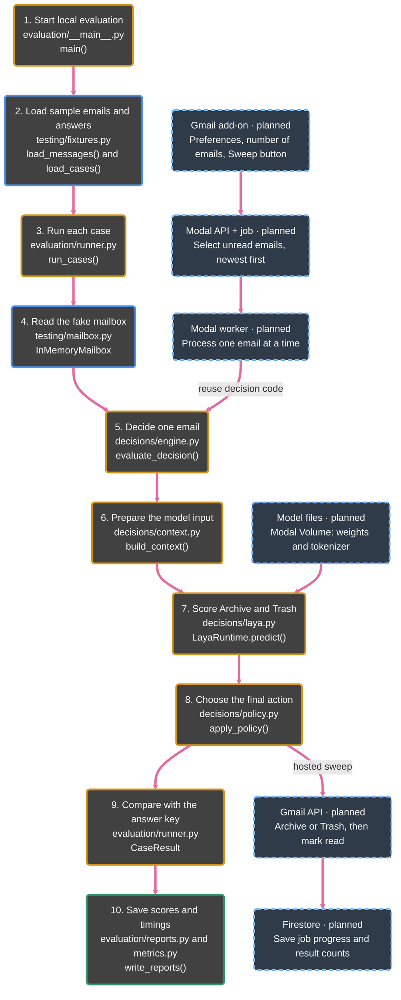

# Sweep

Sweep will be a Gmail add-on that clears a chosen number of unread emails using your written preferences. For each email, Laya chooses **Archive** or **move to Trash**; Sweep marks successful decisions read and saves a summary.

**Status:** The local evaluator and fake mailbox work. The Gmail add-on, Modal worker, and Firestore storage are planned. The current model baseline archives every valid test case, so it is not ready to change a real inbox.

## Code map

Follow the pink arrows. Solid boxes are implemented; dashed boxes are planned. File paths are under `src/sweep/`.

The evaluator compares answers only **after** the decision. It does not change Gmail.

[Quickstart](docs/development.md) · [MVP scope](docs/product.md) · [MIT License](LICENSE)
