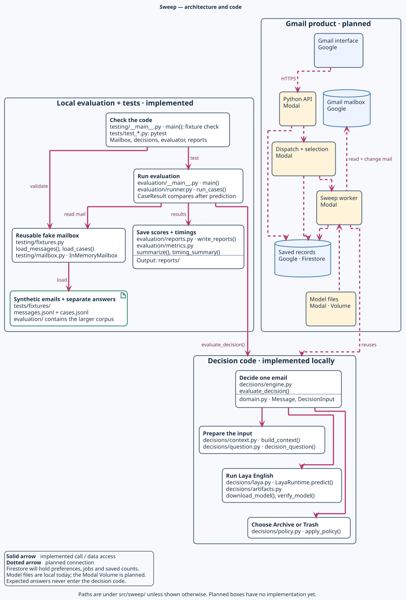

# Sweep

Sweep will be a Gmail add-on that clears a chosen number of unread emails using your written preferences. For each email, Laya chooses **Archive** or **move to Trash**; Sweep marks successful decisions read and saves a summary.

**Status:** The local evaluator and fake mailbox work. The Gmail add-on, Modal worker, and Firestore storage are planned. The current model baseline archives every valid test case, so it is not ready to change a real inbox.

**Development:** [MVP board](https://github.com/users/dylanrkuster/projects/4) · [Ready queue](https://github.com/users/dylanrkuster/projects/4/views/2) (collaborator access required). Pick an unassigned, unblocked issue by priority, then queue order.

## Code map

The planned Gmail system and the code built so far. Blank service boxes are still to be implemented.

[PlantUML source](docs/diagrams/sweep.puml)

[Quickstart](docs/development.md) · [MVP scope](docs/product.md) · [MIT License](LICENSE)
