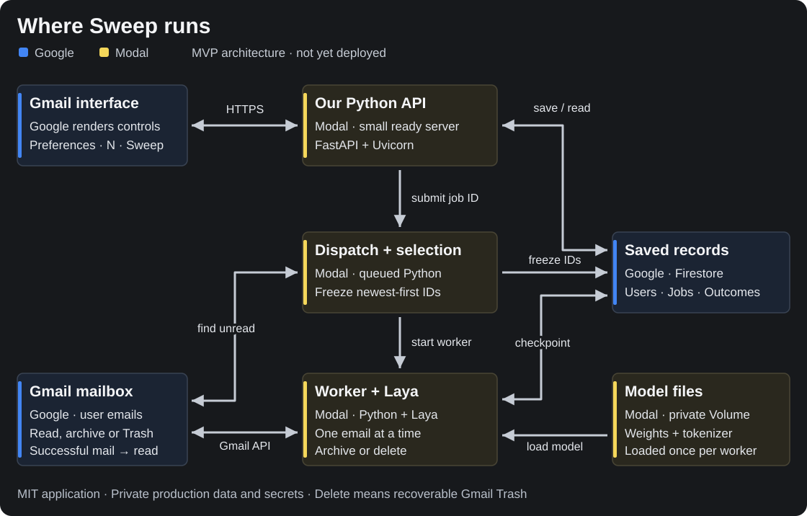

# Sweep

Handle my inbox the way I would.

Sweep is an open-source Gmail add-on for clearing unread email with one button.

Set your preferences, choose how many unread emails to sweep, and press **Sweep**. The MVP processes messages from newest to oldest, one at a time. Laya English makes one decision per email: **archive** or **move to Trash**. Successfully processed messages are marked read, and Sweep saves a summary of the results.

Delete means Gmail's recoverable Trash behavior; Sweep does not permanently delete messages. Gmail ordinarily removes trashed mail after 30 days.

## Project status

MVP scope finalized September 22, 2026. The standalone Laya evaluator is implemented, with synthetic emails, exact context budgeting and decision reports. Initial decision quality needs improvement; Gmail integration and hosting are still to come.

- Native Gmail Google Workspace add-on.
- Python API and background worker hosted on Modal.
- Google Firestore for preferences, job state and saved results.
- Laya English with an initial 2,048-token decision context.
- Initial hosting target: recurring free allowances, subject to measured usage.

The first implementation milestone is a standalone evaluator using synthetic emails to check decisions, memory use and latency. Custom labels, billing and enterprise features are later work.

## Run the foundation locally

With [uv](https://docs.astral.sh/uv/getting-started/installation/) installed, run these commands from this repository:

```sh
uv sync --locked
uv run --locked python -m sweep.testing --messages tests/fixtures/messages.jsonl --cases tests/fixtures/cases.jsonl
uv run --locked pytest
```

The first command creates an isolated Python 3.11 environment and installs the versions in `uv.lock`. The fixture command validates the sample emails and separate answer key, then assembles decision inputs. It does not load Laya, make predictions or connect to Gmail. See the [development guide](docs/development.md) for a tour of the code and fixture format.

To run the real model, follow [Run Laya](docs/development.md#run-laya). The [first baseline](docs/baseline.md) records both performance and the current decision-quality limitations.

If Python cannot find `sweep`, see the [setup troubleshooting notes](docs/development.md#troubleshooting-python-cannot-find-sweep), including the macOS hidden-file issue encountered during initial development.

## Architecture

[](docs/assets/architecture.svg)

Google displays Sweep's interface inside Gmail. Our Python API on Modal receives button clicks and starts background jobs. A worker loads Laya into its own process, handles emails one at a time through the Gmail API, and saves progress in Firestore. Modal stores the model files between runs.

This is the selected design, not a deployed system or a measured performance promise. The [architecture guide](docs/architecture.md) explains each component, where its code runs, and how one Sweep request moves through the system.

## Development plan

We begin with a standalone Laya evaluator and a reusable fake mailbox. Synthetic messages stay separate from their expected answers, so Laya only receives email content and preferences. The same message format and decision code will later serve the real Gmail worker; the fake mailbox will grow to support job and recovery tests.

- [Product scope](docs/product.md): MVP behavior, decisions and input budgets.
- [Code map](docs/code-map.md): current files, major functions and how they connect.
- [Architecture explained](docs/architecture.md): components, communication and job lifecycle.
- [Database design](docs/database.md): proposed records, example documents and recovery rules.
- [Evaluator implementation plan](docs/evaluator-plan.md): the first build, step by step.

## License

Sweep's application code uses the [MIT License](LICENSE). Model weights and dependencies retain their respective licenses. A paid managed service may be offered separately.
