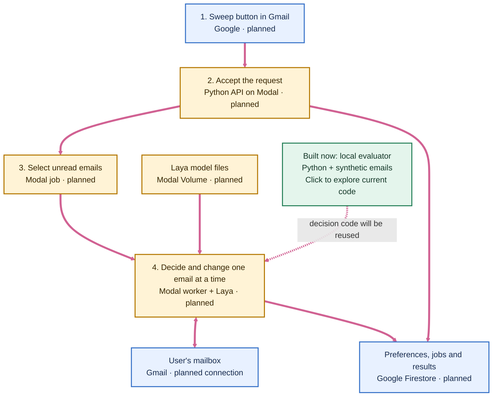
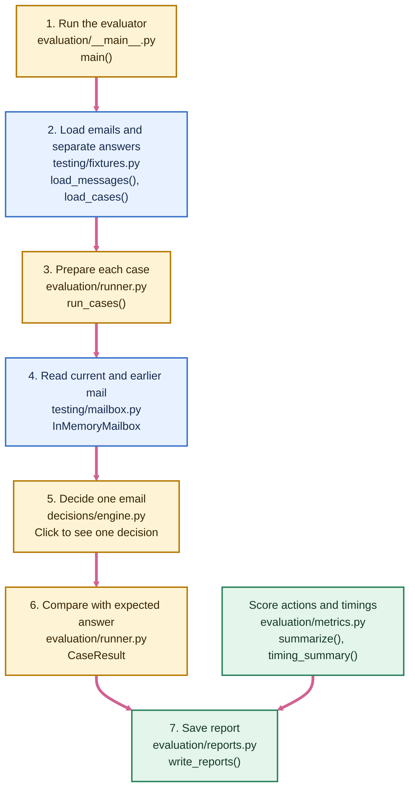
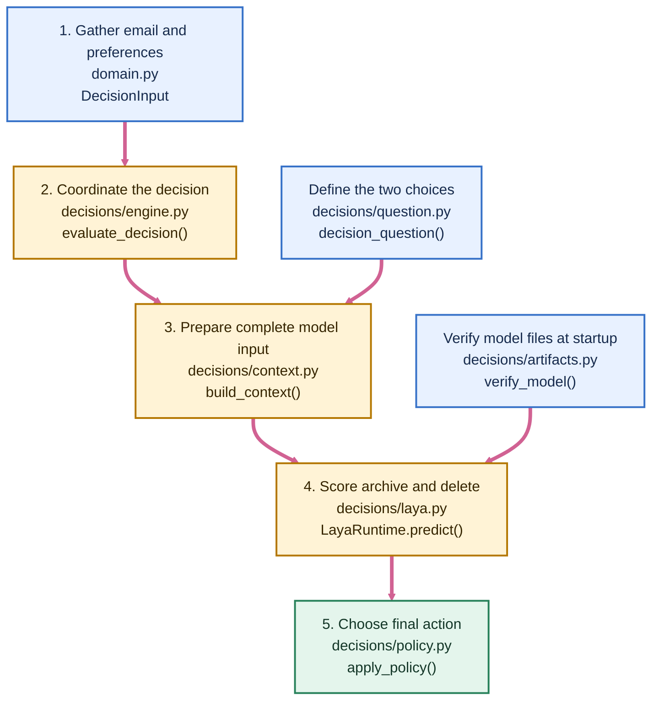

# Sweep architecture

[README](../README.md) · [Detailed explanation](architecture-guide.md) · [Database](database.md)

This is Sweep's **one architecture map**. The overview shows the selected Gmail product; the lower diagrams show code that exists today. Start at **1** and follow the pink arrows. A box names what does the work and where it lives. Click a box to open its explanation or source file.

## Overview

The future path is **Gmail → Modal API → background job → worker**. The worker will call Laya in its own Python process, change the mailbox through Gmail's API and save progress in Firestore. Only the local evaluator below is implemented. [How the planned system works](architecture-guide.md) · [Explore current code ↓](#implemented-evaluator)

## Implemented evaluator

The local evaluator checks Sweep's decisions against synthetic emails. The numbered boxes trace one case; side boxes supply saved data or scoring.

Step 3 repeats steps 4–6 for each case. Step 2 loads the separate expected answer, but the runner uses it only at step 6, **after** prediction; Laya never sees it. The [fixture-only command](../src/sweep/testing/__main__.py) checks the sample data without loading Laya. [↑ Overview](#overview) · [One decision ↓](#one-decision)

## One decision

The evaluator calls this same decision code for every email. Side boxes provide the fixed question and verified model files.

`build_context()` rejects invalid or oversized input rather than clipping it. `LayaRuntime.predict()` returns scores. `apply_policy()` checks those scores and chooses an action. This code does **not** change Gmail. [↑ Evaluator](#implemented-evaluator) · [↑ Overview](#overview)

Keep the overview limited to major components. Add a small linked detail diagram when a component needs more explanation, and update the map alongside code changes.
