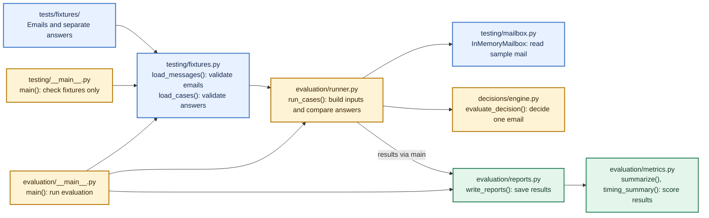
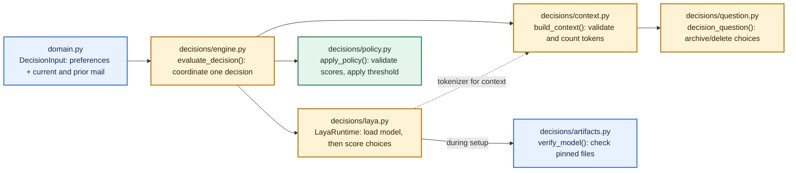

# Code map

This map shows **code that exists now**. Arrows mean a function calls another function or passes it data. The [architecture guide](architecture.md) shows the planned Gmail, Modal and Firestore system.

## From sample emails to a report

The fixture-check command runs `testing/__main__.py:main()` and stops after assembling inputs; it never runs Laya. The evaluator command runs `evaluation/__main__.py:main()`. It sends the **email and preferences** to the decision code, then `run_cases()` compares the result with the separate answer key. The answer is never sent to Laya.

## One decision

`build_context()` either returns the complete input within the token limit or reports an error; it never silently clips an email. `LayaRuntime.predict()` returns scores, and `apply_policy()` turns valid scores into an archive/delete decision. This path **does not change a mailbox**.

## Find the code

| File | Main responsibilities |
| --- | --- |
| [domain.py](../src/sweep/domain.py) | `Message` and `Attachment` describe email facts; `DecisionInput` carries only data available to the model. |
| [testing/fixtures.py](../src/sweep/testing/fixtures.py) | `load_messages()` validates mail; `load_cases()` validates expected answers and dataset splits. |
| [testing/mailbox.py](../src/sweep/testing/mailbox.py) | `InMemoryMailbox.get_message()` finds one email; `get_prior_thread_messages()` finds strictly earlier mail in its thread. `reset()` restores the starting snapshot. |
| [testing/__main__.py](../src/sweep/testing/__main__.py) | `main()` checks fixtures and builds sample decision inputs without running the model. |
| [decisions/engine.py](../src/sweep/decisions/engine.py) | `evaluate_decision()` runs context building, prediction and policy in order. |
| [decisions/context.py](../src/sweep/decisions/context.py) | `build_context()` validates preferences and mail, prepares exact model tokens and enforces the limit. |
| [decisions/question.py](../src/sweep/decisions/question.py) | `decision_question()` defines the archive/delete question sent to Laya. |
| [decisions/artifacts.py](../src/sweep/decisions/artifacts.py) | `download_model()` explicitly fetches pinned files; `verify_model()` checks them locally. |
| [decisions/laya.py](../src/sweep/decisions/laya.py) | `LayaRuntime.__init__()` verifies and loads the model; `predict()` scores the prepared choices. |
| [decisions/policy.py](../src/sweep/decisions/policy.py) | `check_threshold()` validates the setting; `apply_policy()` validates scores and selects the action. |
| [evaluation/__main__.py](../src/sweep/evaluation/__main__.py) | `main()` loads fixtures and Laya, runs cases, then writes a report. |
| [evaluation/runner.py](../src/sweep/evaluation/runner.py) | `run_cases()` builds inputs from the fake mailbox and joins predictions to expected answers afterward. |
| [evaluation/metrics.py](../src/sweep/evaluation/metrics.py) | `summarize()` counts decisions/errors; `timing_summary()` measures inference and context timing. |
| [evaluation/reports.py](../src/sweep/evaluation/reports.py) | `write_reports()` saves Markdown, JSON and CSV results without email bodies. |

Update this map when the responsibilities or connections above change. The [development guide](development.md) has the commands for running each path.
